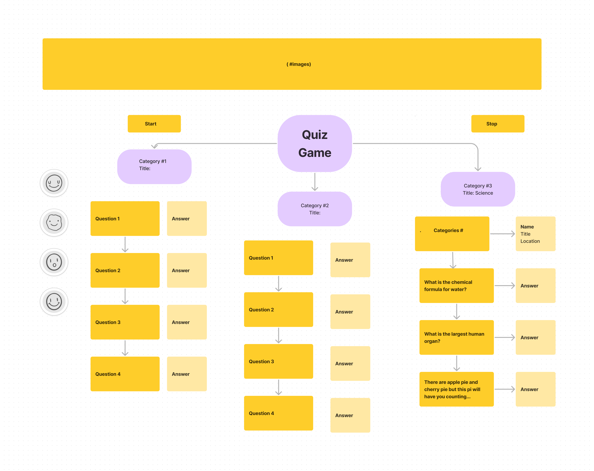
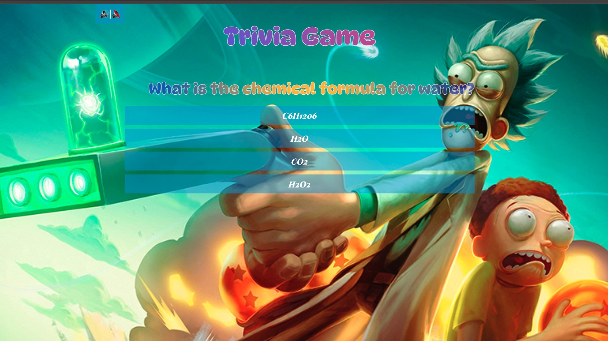

# Quiz Game

**creating a quiz game reqiures the following steps.**
***Step 1: Set up the HTML structure***
***Step 2: Define the questions and answers***
***Step 3: Display questions and handle user input***
***Step 4: Style your quiz game***
***Step 5: Test your quiz game***

## Step 1: Set up the HTML structure
Create an HTML file (index.html) with the standard boilerplate, then add the basic structure for your quiz game.

```
<!DOCTYPE html>
<html lang="en">
<head>
    <meta charset="UTF-8">
    <meta name="viewport" content="width=device-width, initial-scale=1.0">
    <title>Document</title>
</head>
<body>
    
</body>
</html>
```

## Step 2: Define the questions and answers
In your JavaScript file (quiz.js), define an array of quiz questions along with their choices and correct answers:
- This array stores objects, each representing a question in the trivia game.
   - Each question object contains:
     - `question`: The text of the question.
     - `choices`: An array of strings representing the possible choices for the answer.
     - `correctAnswer`: A string representing the correct answer among the choices.

## Step 3: Display questions and handle user input
On javascript, write code to display questions and user input:

1. **Variables**:
   - Create variables to store references to HTML elements in the document.
    
   - create new variable that keeps track of current question being displayed and player score
   - `currentQuestionIndex` 
   - `score`: 

2. **Create a current question functions**:
   - Add function that displays current question and its choices.
   - Let this function be responsible for displaying the current question and its choices.
   - Let it retrieves the current question object from the `questionAndAnswer` array using `currentQuestionIndex`.
   - Allow it to update the text content of the question element (`questionElement`) with the current question.
   - Let it also clear the choices element (`choicesElement`).
   - Let it iterates over the choices of the current question.
   
   **creates a button for each choice**
   create buttons for each choices and adds event listeners to the buttons to handle clicks, and appends the buttons to the choices element.

3. **Create a function that check answer**:
   - This function will be called when a player selects an answer by clicking on a choice button.
   - It then compares the selected answer with the correct answer stored in the current question object.
   - If the selected answer is correct, it increments the `score` variable and displays "Correct!" in the result element (`resultElement`); otherwise, it displays "Incorrect!".
   - It disables further clicks on choice buttons and the submit button to prevent multiple submissions.
   - It schedules the display of the next question or the final result after a short delay using `setTimeout()`.

4. **Create display result function**:
   - This function is called when all questions have been answered.
   - It clears the question and choices elements.
   - It displays the player's final score along with the total number of questions.

5. **Initial Setup**:
   - The code starts by displaying the first question using `displayQuestion()` when the page loads.


## Step 4: Style your quiz game
Create a CSS file (quiz.css) to style your quiz game:
  - To add image to the background of the trivia game.
  - `body`: Sets the background image using the provided URL, covers the entire viewport, and centers the image.
  - `.container`: Adds a semi-transparent white background to the container for better readability of text.
  - **audio**: This section styles the audio element on the page.
  - **h1**: This section styles the `<h1>` element.
  - **#question**: This section styles an element with the ID "question".
  - **#choices**: This section styles an element with the ID "choices".
  - **button**: This section styles button elements.
  - **button:hover**: This section styles button elements when hovered over.
  - **#submit**: This section styles an element with the ID "submit".
  - **#result**: This section styles an element with the ID "result".


  

## Step 5: Test your quiz game
Test your quiz game by opening the HTML file in a web browser. The questions should be displayed one by one. After answering all questions, the final score will be shown.

## This is just a draft/


## Screenshot of Trivia Game



